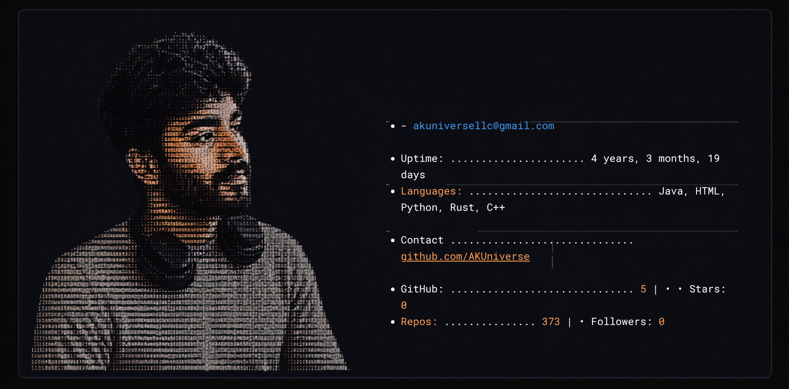

<div align="center">

  <!-- Main Hero Profile Art Card -->
  <a href="https://akuniverse.pages.dev/">
    
  </a>

  <br/><br/>

  <!-- Dynamic Typing Animation Banner -->
  <a href="https://akuniverse.pages.dev/">
    
  </a>

  <br/><br/>

  <!-- Status Badges Bar -->
  <a href="mailto:akuniversellc@gmail.com">
    
  </a>
  <a href="mailto:akuniversellc@gmail.com">
    
  </a>
  <a href="https://akuniverse.pages.dev/">
    
  </a>
  <a href="https://github.com/AKUniverse">
    
  </a>

  <br/><br/>

  <!-- Metric Badges Row -->
  <p>
    
    
    
    
  </p>

  <!-- Quick Navigation Pill Bar -->
  <p>
    <a href="#-what-i-build-for-clients"><b>🛠️ Services</b></a> &nbsp;•&nbsp;
    <a href="#-featured-projects--case-studies"><b>🚀 Projects</b></a> &nbsp;•&nbsp;
    <a href="#-technical-arsenal"><b>💻 Tech Stack</b></a> &nbsp;•&nbsp;
    <a href="#-client-collaboration-process"><b>🔄 Workflow</b></a> &nbsp;•&nbsp;
    <a href="#-frequently-asked-questions"><b>❓ Client FAQ</b></a> &nbsp;•&nbsp;
    <a href="#-lets-connect--start-a-project"><b>📬 Hire Me</b></a>
  </p>

</div>

---

## 👨‍💻 Executive Summary

I am **Ameer Khan**, Founder & Principal Systems Architect at **AK UNIVERSE LLC**. I build robust digital infrastructure for businesses worldwide—specializing in **full-stack web platforms, high-speed automated systems, hardened Linux VPS architectures, and complex data extraction pipelines**.

Whether you need a high-converting web app in **React / Next.js / Astro**, an automated multi-account **Facebook auto-listing bot**, a high-concurrency verification backend in **Python / Node.js / Rust**, or a fully managed **Linux VPS server with Nginx and PostgreSQL**, I deliver scalable, production-ready systems that generate immediate business value.

```text
┌────────────────────────────────────────────────────────────────────────────────────────┐
│  💼 Business Entity : AK UNIVERSE LLC (Sheridan, WY, USA)                               │
│  🎯 Core Offerings  : Full-Stack Web, VPS Infrastructure, Automated Bots & Custom APIs │
│  ⚡ Flagship Works  : FBVerse Auto-Listing Bot, SMSOTPs Verification Gateway           │
│  📬 Direct Inquiries: akuniversellc@gmail.com                                          │
└────────────────────────────────────────────────────────────────────────────────────────┘
```

---

## 🛠️ What I Build For Clients

<table>
  <thead>
    <tr>
      <th width="50%"><h3>⚛️ Modern Full-Stack & SSR Web Apps</h3></th>
      <th width="50%"><h3>⚡ High-Throughput Backends & APIs</h3></th>
    </tr>
  </thead>
  <tbody>
    <tr>
      <td>
        <ul>
          <li><b>Next.js & React</b>: Scalable full-stack web applications with App Router, Server Components, and SSR/SSG.</li>
          <li><b>Astro & Vite</b>: Ultra-fast content-driven sites, blogs, and landing pages scored 100/100 on Lighthouse.</li>
          <li><b>Interactive UI/UX</b>: Tailored interfaces crafted with Tailwind CSS, TypeScript, and fluid micro-animations.</li>
          <li><b>Real-Time Dashboards</b>: Live administrative portals with WebSocket streams and instant data synchronisation.</li>
        </ul>
      </td>
      <td>
        <ul>
          <li><b>Node.js & Express / FastAPI</b>: Asynchronous REST, GraphQL, and WebSocket APIs built for sub-millisecond response.</li>
          <li><b>Concurrent Task Workers</b>: High-volume background task queues powered by Redis and Celery.</li>
          <li><b>Systems Programming</b>: Memory-efficient low-level microservices in <b>Rust</b> and <b>C++</b>.</li>
          <li><b>Payment & Messaging APIs</b>: Turnkey integrations for Stripe, SMS, webhooks, and OTP delivery services.</li>
        </ul>
      </td>
    </tr>
    <tr>
      <th width="50%"><h3>🗄️ Relational & NoSQL Database Systems</h3></th>
      <th width="50%"><h3>🖥️ Linux VPS Management & Cloud DevOps</h3></th>
    </tr>
    <tr>
      <td>
        <ul>
          <li><b>PostgreSQL & MySQL</b>: Robust relational database design, indexing, complex querying, and migrations.</li>
          <li><b>MongoDB & Document Stores</b>: Flexible NoSQL architecture for dynamic, high-velocity datasets.</li>
          <li><b>Redis In-Memory Caching</b>: Sub-millisecond caching, distributed locks, session storage, and rate limiting.</li>
          <li><b>Type-Safe ORM Integration</b>: Clean database querying using Prisma, SQLAlchemy, and Drizzle ORM.</li>
        </ul>
      </td>
      <td>
        <ul>
          <li><b>VPS Server Setup & Hardening</b>: Ubuntu/Debian server provisioning, SSH key security, and UFW firewalls.</li>
          <li><b>Nginx Reverse Proxy & SSL</b>: Automated Let's Encrypt SSL/TLS, load balancing, and gzip/brotli compression.</li>
          <li><b>Process Management</b>: Reliable 24/7 daemonization via PM2, systemd services, and Docker containerization.</li>
          <li><b>Cloud & Edge Networks</b>: Cloudflare Workers, Pages, DNS routing, and automated CI/CD deployments.</li>
        </ul>
      </td>
    </tr>
    <tr>
      <th width="50%"><h3>🤖 Enterprise Web Automation & Scraping</h3></th>
      <th width="50%"><h3>🔐 Security, Reverse Engineering & Auth</h3></th>
    </tr>
    <tr>
      <td>
        <ul>
          <li><b>Stealth Browser Emulation</b>: Undetected automation utilizing Playwright, Puppeteer, and Selenium.</li>
          <li><b>Anti-Bot Bypassing</b>: Intelligent fingerprint spoofing, Cloudflare Turnstile, and CAPTCHA handling.</li>
          <li><b>Session & Token Lifecycle</b>: Multi-account session rotators, cookie extractors, and token refresh managers.</li>
          <li><b>Distributed Crawlers</b>: High-volume parallel web parsers with automatic proxy pool rotation.</li>
        </ul>
      </td>
      <td>
        <ul>
          <li><b>Protocol Reverse Engineering</b>: Reverse engineering private mobile/web APIs for direct headless exchange.</li>
          <li><b>Automated Auth Pipelines</b>: OAuth2, SSO, 2FA validation, and secure credential storage workflows.</li>
          <li><b>Encrypted Communications</b>: Custom cryptographic payload signing and SSL pinning bypass tooling.</li>
          <li><b>Telemetry & Logging</b>: Automated Discord/Telegram alert bots for system health and critical errors.</li>
        </ul>
      </td>
    </tr>
  </tbody>
</table>

---

## 🚀 Featured Projects & Case Studies

<table>
  <tr>
    <td width="33%" align="center">
      <br/>
      
      <h3>🌐 FBVerse Automation Bot</h3>
      <p><b>Enterprise Facebook Auto-Listing Engine</b></p>
      <p>High-volume marketplace automation bot handling batch item publishing, asset upload, multi-account session rotation, and anti-ban stealth emulation.</p>
      <a href="https://fbverse.pages.dev/">
        
      </a>
      <br/><br/>
    </td>
    <td width="33%" align="center">
      <br/>
      
      <h3>📲 SMSOTPs Gateway</h3>
      <p><b>Real-Time Verification & OTP API Platform</b></p>
      <p>Distributed backend API system managing instantaneous automated routing, webhook triggers, and OTP lifecycle verifications at scale.</p>
      <a href="http://smsotps.com/">
        
      </a>
      <br/><br/>
    </td>
    <td width="33%" align="center">
      <br/>
      
      <h3>🍪 Cookie & Auth Extractor</h3>
      <p><b>Mobile Browser Simulation Engine</b></p>
      <p>Advanced mobile browser simulation engine designed for batch session extraction, multi-account token harvesting, and auth validation.</p>
      <a href="https://github.com/AKUniverse/Free-Facebook-Cookie-Extractor">
        
      </a>
      <br/><br/>
    </td>
  </tr>
</table>

> [!NOTE]
> **🔒 Enterprise & Private Client Projects (Under NDA):**
> We have engineered and delivered dozens of production systems for international clients—including high-frequency e-commerce bots, custom web scraping infrastructure, secure fintech/crypto wrappers, and internal automation dashboards. In compliance with client **NDAs and privacy agreements**, these proprietary codebases are kept in private repositories. Private code walkthroughs and architectural demos are available upon request.

---

## 💻 Technical Arsenal

<div align="left">

### 1. 🎨 Modern Frontend & Full-Stack Frameworks
<p>
  
  
  
  
  
  
  
  
</p>

### 2. ⚡ Backend, APIs & Microservices
<p>
  
  
  
  
  
  
  
</p>

### 3. 🗄️ Databases, ORMs & Caching
<p>
  
  
  
  
  
  
  
</p>

### 4. ⚙️ Systems & Core Languages
<p>
  
  
  
  
  
  
  
</p>

### 5. 🖥️ VPS Servers, Linux Administration & Cloud DevOps
<p>
  
  
  
  
  
  
  
</p>

### 6. 🤖 Automation, Scraping & Reverse Engineering
<p>
  
  
  
  
  
  
</p>

</div>

---

## 🔄 Client Collaboration Process

How we take your project from concept to production in four smooth phases:

```text
┌─────────────────────────┐      ┌─────────────────────────┐      ┌─────────────────────────┐      ┌─────────────────────────┐
│ 1. Discovery & Scope    │ ───> │ 2. Prototype & Bypass   │ ───> │ 3. Resilient Build      │ ───> │ 4. Deploy & Support     │
├─────────────────────────┤      ├─────────────────────────┤      ├─────────────────────────┤      ├─────────────────────────┤
│ • Analyze requirements  │      │ • Rapid POC execution   │      │ • Full-stack dev        │      │ • VPS / Cloud deploy    │
│ • Identify challenges   │      │ • Anti-bot test & bypass│      │ • Auto-retry & alerts   │      │ • Complete docs & guide │
│ • Define architecture   │      │ • Database schema setup │      │ • Clean, modular code   │      │ • Ongoing SLA & updates │
└─────────────────────────┘      └─────────────────────────┘      └─────────────────────────┘      └─────────────────────────┘
```

---

## 🏆 Why Clients Choose AK UNIVERSE LLC

```text
┌──────────────────────────────┬─────────────────────────────────────────────────────────────────────────────┐
│ ⚡ Rapid & Reliable Delivery │ Quick turnaround times without compromising on software engineering rigor.  │
│ 🖥️ Turnkey VPS & Cloud Setup │ Production deployments configured with Nginx, SSL, Docker, and auto-restart.│
│ 🛡️ 99.9% Automation Uptime   │ Built-in fault tolerance, auto-restarts, proxy failover, and self-healing.  │
│ 📖 Clean & Documented Code   │ Comprehensive READMEs, inline documentation, and turnkey Docker configs.    │
│ 🔒 Total IP & Confidentiality│ 100% intellectual property ownership transferred to client upon completion. │
│ 💬 Direct Communication      │ Fast responses via Email, Telegram, or scheduled consultation calls.        │
└──────────────────────────────┴─────────────────────────────────────────────────────────────────────────────┘
```

---

## ❓ Frequently Asked Questions

<details>
  <summary><b>Q: What types of projects do you accept?</b></summary>
  <br/>
  I build modern full-stack web applications (React, Next.js, Astro), configure Linux VPS production servers, engineer high-volume scraping and automation pipelines, develop high-speed backend APIs, design SQL/NoSQL databases, and build real-time bots.
</details>

<details>
  <summary><b>Q: Can you setup and manage our VPS servers and databases?</b></summary>
  <br/>
  Yes. I handle full Linux VPS lifecycle management (Ubuntu/Debian), Nginx reverse proxy configuration, automated SSL certificates, PM2/systemd process monitoring, Docker containerization, firewall security, and PostgreSQL/MySQL/Redis setup and backups.
</details>

<details>
  <summary><b>Q: Can you bypass complex protections like Cloudflare, DataDome, or Akamai?</b></summary>
  <br/>
  Yes. I implement advanced browser fingerprint randomization, humanized mouse/keyboard emulation, residential proxy routing, and TLS/JA3/JA4 fingerprint matching to maintain stable, long-term extraction workflows.
</details>

<details>
  <summary><b>Q: What are your hiring engagement models?</b></summary>
  <br/>
  I work on both <b>Fixed-Price Milestone Contracts</b> (ideal for defined deliverables) and <b>Hourly / Retainer Engagements</b> (ideal for ongoing development, scaling, and system maintenance).
</details>

<details>
  <summary><b>Q: How do you deliver the final work?</b></summary>
  <br/>
  All projects are delivered in private GitHub repositories or compressed archives with complete Docker setup, detailed step-by-step setup guides, configuration files, and test scripts.
</details>

---

## 📬 Let's Connect & Start a Project

Ready to build your next web application, configure your VPS infrastructure, or automate your business workflows? Reach out today for a consultation or quote.

<div align="center">

  <br/>

  <a href="mailto:akuniversellc@gmail.com">
    
  </a>
  &nbsp;&nbsp;&nbsp;
  <a href="https://akuniverse.pages.dev/">
    
  </a>
  &nbsp;&nbsp;&nbsp;
  <a href="https://github.com/AKUniverse">
    
  </a>

  <br/><br/>
  
  <sub>© AK UNIVERSE LLC &bull; Engineered for Performance & Reliability</sub>

</div>
